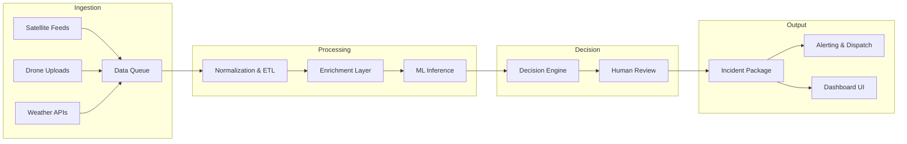
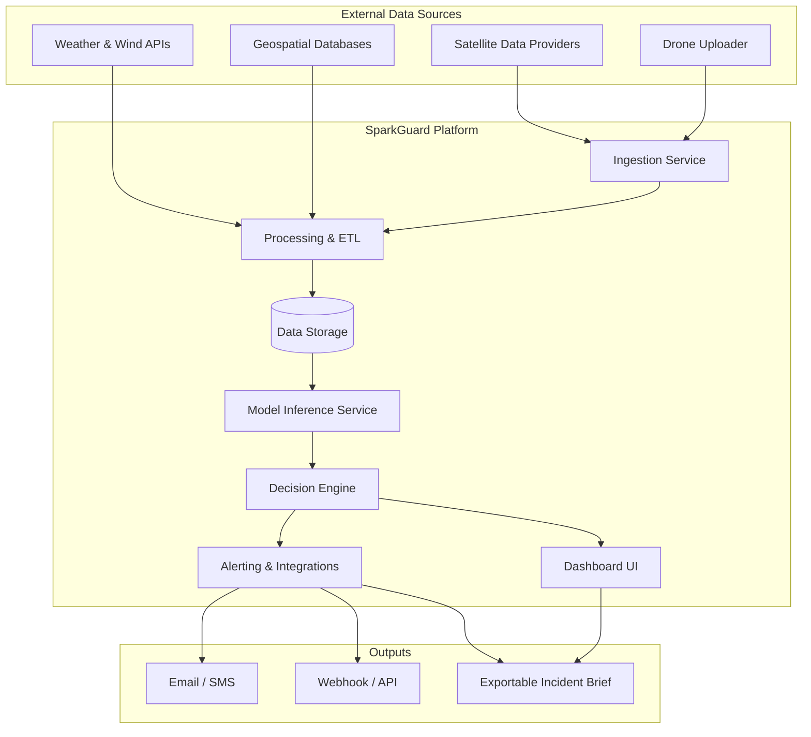

# 🔥 SparkGuard

**AI-powered fire prevention and emergency response decision support — unifying satellite intelligence, drone reconnaissance, and actionable guidance for first responders.**

---

## 📌 Quick Links

| Section | Jump |
|---------|------|
| [Elevator Pitch](#-elevator-pitch) | What we do in 30 seconds |
| [Problem](#-problem) | Why this matters |
| [Solution](#-solution-overview) | What we built |
| [Key Features](#-key-features) | Capabilities at a glance |
| [How It Works](#-how-it-works) | End-to-end pipeline |
| [Architecture](#-system-architecture) | Technical diagram |
| [AI Decision Support](#-ai-decision-support) | Human + AI collaboration |
| [Prototype Scope](#-prototype-scope) | What's in the demo |
| [Business Model](#-business-model-snapshot) | Path to market |
| [Getting Started](#-getting-started) | Run it yourself |

**Deliverables:** [Pitch Deck][PITCH_DECK_LINK] · [Business Model Canvas][BMC_LINK] · [Prototype Demo][DEMO_LINK]

---

## 🚀 Elevator Pitch

Wildfires and structural fires cause billions in damage, claim lives, and overwhelm emergency services every year. Current response systems rely on fragmented data, delayed satellite imagery, and manual coordination.

**SparkGuard** is a unified platform that ingests existing satellite-derived data (including CubeSat sources), supplements gaps with optional drone reconnaissance, and delivers AI-assisted decision support to emergency responders. Instead of raw data dumps, we generate structured **incident packages** — actionable briefs with location context, weather conditions, recommended response actions, and visual overlays — so teams can act faster and smarter.

Built for the **Upstart Competition (GCES Concordia)** under the themes of **Health & Wellness** and **Smart Systems**.

---

## 🔴 Problem

### Why It Matters

- **Delayed detection**: Satellite revisit times can miss fast-moving fires; ground reports are often too late.
- **Fragmented data**: Weather, terrain, satellite imagery, and local intel exist in silos — responders must manually piece together situational awareness.
- **Information overload**: Raw feeds without interpretation slow decision-making during critical windows.
- **Blind spots**: Satellites lack detail for indoor fires, tunnels, dense urban canyons, and isolated environments.

### Who Is Affected

| Stakeholder | Pain Point |
|-------------|------------|
| Fire departments | Incomplete scene intel before dispatch |
| Emergency managers | No unified view across data sources |
| Municipal governments | Reactive rather than preventive posture |
| Communities | Slower evacuations, prolonged smoke exposure |

### Real-World Constraints

- Emergency budgets are tight; solutions must leverage **existing infrastructure**.
- First responders need **simple outputs**, not dashboards requiring training.
- Drone operations face regulatory, connectivity, and safety limitations.

---

## 💡 Solution Overview

SparkGuard is a **software platform** that:

1. **Ingests** publicly available and commercial satellite-derived data (thermal anomalies, hotspot feeds, imagery).
2. **Supplements** with optional drone data for localized scenes where satellites lack resolution or access.
3. **Processes** incoming data through analytics pipelines to detect, classify, and contextualize fire events.
4. **Generates** structured incident packages with recommended actions, wind/weather context, and visual overlays.
5. **Distributes** packages to emergency services via configurable channels (email, SMS, webhook, exportable briefs).

### What the Prototype Demonstrates

- End-to-end data flow from ingestion to alert generation (simulated feeds).
- Dashboard UI for viewing active incidents and drilling into details.
- Sample incident package with recommended actions.
- Drone data upload flow and integration concept.

---

## ✨ Key Features

### 🛰️ Satellite Intelligence
- Ingest thermal anomaly and hotspot data from existing satellite feeds
- Support for CubeSat-class data sources with higher revisit frequencies
- Automated parsing of standard fire detection formats (e.g., FIRMS-compatible)

### 🚁 Drone Assistance
- Upload portal for drone-captured imagery, video, and thermal data
- Designed for scenarios where satellites lack detail: tunnels, building interiors, dense urban areas
- Feeds directly into platform for enhanced situational awareness

### 🧠 Decision Support
- AI-assisted interpretation of multi-source data
- Systematic querying of contextual databases (terrain, infrastructure, historical incidents)
- Confidence scoring and uncertainty flagging for human review

### 📊 Operations Dashboard
- Unified view of active and historical incidents
- Incident package generation and export
- Configurable alerting rules and distribution channels

---

## ⚙️ How It Works

**Step-by-step pipeline from data ingestion to dispatch:**

| Step | Action | Output |
|------|--------|--------|
| 1️⃣ | **Ingest** satellite feeds (thermal, imagery) and optional drone uploads | Raw data in queue |
| 2️⃣ | **Normalize** data formats, georeference, timestamp alignment | Unified event records |
| 3️⃣ | **Enrich** with weather/wind data, terrain, infrastructure proximity | Contextualized events |
| 4️⃣ | **Analyze** via ML models for classification, spread prediction, severity | Model outputs + confidence |
| 5️⃣ | **Decide** — AI surfaces recommendations; human reviews and approves | Draft incident package |
| 6️⃣ | **Dispatch** — finalized package sent via configured channels | Alert delivered |



---

## 🏗️ System Architecture



### Component Summary

| Component | Responsibility |
|-----------|----------------|
| **Ingestion Service** | Connects to external feeds, handles drone uploads, queues incoming data |
| **Processing & ETL** | Normalizes formats, enriches with weather/terrain, prepares for analysis |
| **Data Storage** | Persists raw and processed data, incident history, model outputs |
| **Model Inference** | Runs classification, severity estimation, spread prediction models |
| **Decision Engine** | Synthesizes model outputs into recommendations, manages human review flow |
| **Alerting & Integrations** | Dispatches incident packages via configured channels |
| **Dashboard UI** | Operator interface for monitoring, review, and manual overrides |

---

## 📡 Data Sources & Integrations

### Planned / Compatible Sources

> ⚠️ *The following are examples of compatible data sources — not confirmed integrations. Actual feeds will depend on availability, licensing, and project scope.*

| Category | Example Sources |
|----------|-----------------|
| **Fire/Hotspot Feeds** | NASA FIRMS, NOAA Hazard Mapping System, ESA Active Fire Data |
| **Satellite Imagery** | Sentinel-2, Landsat, commercial CubeSat providers (e.g., Planet Labs) |
| **Weather/Wind** | OpenWeatherMap, Environment Canada, NOAA GFS |
| **Geospatial/Infrastructure** | OpenStreetMap, municipal GIS layers |

### Emergency Services Integrations

SparkGuard is designed with **interface flexibility** — we do not claim live integrations, but the platform supports:

- **Email/SMS**: Configurable alert distribution to dispatch centers or individuals.
- **Webhook/API**: Push incident data to existing CAD (Computer-Aided Dispatch) systems.
- **Exportable Incident Brief**: PDF or structured JSON package for manual handoff.

*Integration depth depends on partnership and compliance requirements.*

---

## 🚁 Drone Concept for Local Scenarios

### When Drones Are Used

Drones supplement satellite data in scenarios where orbital sensors lack detail or access:

- **Indoor/structural fires**: Satellites cannot see inside buildings or tunnels.
- **Dense urban canyons**: Tall buildings obstruct satellite line-of-sight.
- **Isolated environments**: Remote areas with infrequent satellite coverage.
- **Rapid scene updates**: When fresher imagery is needed faster than satellite revisit times.

### How It Works

1. **Tasking**: Operator dispatches drone to incident area (manual or suggested by platform).
2. **Data Collection**: Drone captures images, video, and thermal data (if equipped).
3. **Upload/Streaming**: Data is uploaded via mobile app or streamed over available connectivity.
4. **Platform Integration**: SparkGuard ingests drone data, fuses with satellite context, updates incident package.

### Constraints & Considerations

| Constraint | Mitigation |
|------------|------------|
| **Indoor/tunnel navigation** | GPS-denied navigation is challenging; designed for entry points and exteriors unless specialized equipment available |
| **Connectivity** | Store-and-forward mode for low-bandwidth areas; streaming requires stable link |
| **Safety** | No autonomous operations in active fire zones; operator-in-the-loop required |
| **Regulation** | Operations must comply with local drone regulations (see [Risks & Compliance](#-risks-ethics-privacy--compliance)) |

---

## 🤖 AI Decision Support

### What the AI Does

- **Detects and classifies** fire events from multi-source data.
- **Estimates severity** and potential spread based on weather, terrain, fuel load.
- **Queries contextual databases** (infrastructure proximity, evacuation routes, historical incidents).
- **Generates draft recommendations** — not final orders.

### What Humans Decide

- **Approval of incident packages** before dispatch.
- **Override or adjust** AI recommendations based on local knowledge.
- **Final dispatch authority** remains with emergency personnel.

### Human-in-the-Loop Design

```
┌─────────────┐      ┌─────────────┐      ┌─────────────┐
│  AI Model   │ ──▶  │  Confidence │ ──▶  │   Human     │
│  Output     │      │  Scoring    │      │   Review    │
└─────────────┘      └─────────────┘      └─────────────┘
                            │
                            ▼
                   Low confidence?
                   ──▶ Flag for manual triage
```

- **Confidence/uncertainty** is surfaced for every recommendation.
- **False positive minimization**: Thresholds tuned to avoid alert fatigue; low-confidence events routed to human review rather than auto-dispatched.
- **Explainability**: Key factors behind each recommendation are displayed (wind direction, proximity to structures, etc.).

---

## 🧪 Prototype Scope

### What's Included

| Component | Status |
|-----------|--------|
| Dashboard UI | Clickable mockup / functional prototype |
| Incident package generator | Sample output with mock data |
| Data ingestion pipeline | Simulated feeds (not live satellite connection) |
| Drone upload flow | UI concept and sample data path |
| Alerting integrations | Interface design (email/webhook templates) |

### What's Simulated vs. Real

| Simulated | Real / Functional |
|-----------|-------------------|
| Satellite data feeds (using sample/historical data) | UI and user flows |
| ML model inference (canned outputs or lightweight demo model) | Incident package structure and export |
| Drone data (sample imagery) | System architecture and data flow design |

> *Prototype is designed to demonstrate end-to-end concept and UX — not production-grade data pipelines.*

---

## 🌍 Impact & Sustainability

### Health & Wellness

- **Faster response** = reduced injury and fatality risk for affected communities.
- **Reduced smoke exposure**: Earlier containment limits air quality degradation.
- **Responder safety**: Better intel before arrival reduces unknowns on scene.

### Sustainability

- **Prevention-oriented**: Early detection enables smaller, faster interventions.
- **Reduced burned area**: Limiting fire spread protects ecosystems and reduces carbon release.
- **Efficient resource allocation**: Targeted response avoids unnecessary deployments.

> *We do not claim specific metrics (hectares saved, emissions reduced) without validated data. Impact is projected based on faster detection-to-response cycles.*

---

## 💼 Business Model Snapshot

### Customer Segments

| Segment | Description |
|---------|-------------|
| Municipal fire departments | Primary users of incident packages and dashboard |
| Regional emergency management agencies | Coordination and oversight |
| Forestry and wildfire agencies | Large-area monitoring and prevention |
| Industrial operators | Facilities in fire-prone or remote areas |

### Value Proposition

- **Unified situational awareness** from fragmented data sources.
- **Actionable outputs** (not just raw data) tailored for responders.
- **Modular integration** with existing CAD and communication systems.

### Pricing / Revenue Options

> *Options under consideration — not finalized.*

| Model | Description |
|-------|-------------|
| **SaaS subscription** | Tiered by coverage area, data sources, and user seats |
| **Per-incident fee** | Pay-per-use for smaller departments or seasonal needs |
| **Enterprise license** | Flat annual fee for large agencies with custom integrations |
| **Data marketplace** | Optional premium data layers (commercial satellite, drone networks) |

---

## 🛠️ Getting Started

### A) If You Have the Codebase

> *Tech stack: [TECH_STACK_IF_KNOWN — TBD]*

```bash
# Clone the repository
git clone https://github.com/[REPO_PATH]/SparkGuard.git
cd SparkGuard

# Install dependencies (placeholder — adjust for actual stack)
[INSTALL_COMMAND]

# Configure environment variables
cp .env.example .env
# Edit .env with API keys and configuration

# Run the application
[RUN_COMMAND]
```

*Replace `[INSTALL_COMMAND]` and `[RUN_COMMAND]` with actual commands once stack is finalized (e.g., `npm install` / `npm run dev` for Node.js, `pip install -r requirements.txt` / `python main.py` for Python).*

### B) If You Only Have the Prototype

1. **View the mockups**: [Figma Link][FIGMA_LINK]
2. **Watch the demo walkthrough**: [Demo Video][DEMO_LINK]
3. **Review sample outputs**: See `/samples/` folder for example incident packages and data flows.

---

## 🗺️ Roadmap

| Phase | Milestone |
|-------|-----------|
| **1** | Finalize prototype UI and sample data flows |
| **2** | Integrate one live public fire/hotspot feed (e.g., FIRMS) |
| **3** | Develop lightweight ML model for severity classification |
| **4** | Build drone upload pipeline with mobile app |
| **5** | Pilot with partner fire department (mock exercises) |
| **6** | Add multi-language alerting and accessibility features |

---

## ⚠️ Risks, Ethics, Privacy & Compliance

### Privacy

| Concern | Mitigation |
|---------|------------|
| **Imagery of people/homes** | Satellite resolution typically insufficient for PII; drone imagery reviewed before ingestion; faces/plates blurred if detected |
| **Data retention** | Configurable retention policies; incident data purged after defined period unless required for reporting |
| **Access control** | Role-based access; audit logs for all data views and exports |

### Drone Regulation

> ⚠️ *This is general guidance, not legal advice.*

- Drone operations must comply with local aviation authority regulations (e.g., Transport Canada RPAS rules, FAA Part 107 in the US).
- Operations in emergency zones may require special authorization or coordination with incident command.
- Operator certification and airspace awareness are required.

### Security

- All data in transit encrypted (TLS).
- Authentication required for dashboard and API access.
- Third-party integrations use scoped API keys with least-privilege principles.

### Ethics

- AI recommendations are **advisory only** — humans retain decision authority.
- System designed to **augment, not replace** professional judgment.
- Transparency: factors behind recommendations are always visible.

---

## 👥 Team

| Name | Role |
|------|------|
| [TEAM_MEMBER_1] | [Role — e.g., Project Lead] |
| [TEAM_MEMBER_2] | [Role — e.g., Backend Developer] |
| [TEAM_MEMBER_3] | [Role — e.g., ML Engineer] |
| [TEAM_MEMBER_4] | [Role — e.g., UI/UX Designer] |
| [TEAM_MEMBER_5] | [Role — e.g., Business & Strategy] |

*Team composition placeholder — update with actual names and roles.*

---

## 📜 License

**TBD** — License to be determined. See [LICENSE](LICENSE) file once finalized.

---

## 📬 Contact / Demo

| Resource | Link |
|----------|------|
| **Live Demo** | [DEMO_LINK] |
| **Pitch Deck** | [PITCH_DECK_LINK] |
| **Business Model Canvas** | [BMC_LINK] |
| **Figma Prototype** | [FIGMA_LINK] |
| **Contact Email** | [CONTACT_EMAIL] |

---

## 💡 Why This Is Feasible

SparkGuard is designed around **existing, accessible infrastructure**:

1. **Public satellite data is available today** — NASA FIRMS, Sentinel, and others provide free or low-cost fire detection feeds.
2. **Drone hardware is commodity** — off-the-shelf drones with cameras and thermal sensors are widely available.
3. **Modular integrations** — the platform connects to external systems via standard APIs and export formats, minimizing custom development.
4. **AI is assistive, not autonomous** — we use proven classification techniques with human oversight, avoiding regulatory and liability complexity of fully autonomous systems.

The core innovation is **integration and interpretation** — bringing fragmented data into a unified view and translating it into actionable guidance for responders.

---

<p align="center">
  <strong>SparkGuard</strong> · Built for <a href="#">Upstart @ GCES Concordia</a> · Health & Wellness · Smart Systems
</p>

<!-- Reference Links (update with actual URLs) -->
[DEMO_LINK]: #
[PITCH_DECK_LINK]: #
[BMC_LINK]: #
[FIGMA_LINK]: #